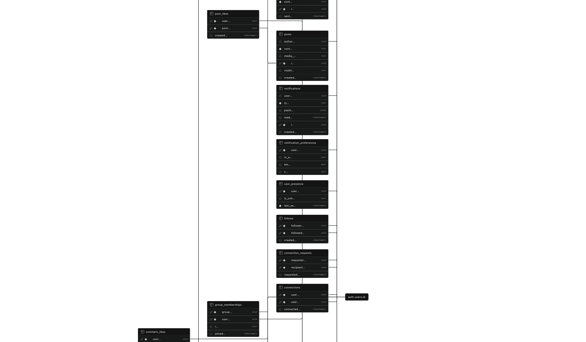

# SOCS

A full-stack social media and networking application built to facilitate secure user connections, real-time communication, and group collaboration. The platform leverages a complex relational database architecture to manage intricate user networks, enforces strict access controls at the data layer, and utilizes a containerized backend server to handle file processing and live messaging pipelines.

## Technologies Used

* **Database & Authentication:** Supabase (PostgreSQL), Supabase Auth, Google OAuth, SHA-256 Hashing
* **Backend Server:** Docker, Custom Backend Functions (Webhooks, File Processing)
* **Real-Time Engine:** Authenticated Webhooks
* **Storage Architecture:** Load-Balanced File Storage, Localized Encryption

## Technical Architecture

### Complex Relational Database & Access Control
The foundation of SOCS is a highly relational, normalized database architecture managed via Supabase. The schema is designed to efficiently handle deep associations and complex queries across multiple entities. It maintains bi-directional user connection graphs, distinct group memberships with multi-tiered role and permission mappings, and highly nested engagement structures (posts, threaded comments, and specific asset likes). 

To ensure data integrity and security, the application enforces strict Row Level Security and access controls directly at the data layer. All POST and GET requests are evaluated against the requester's user ID and active authentication parameters. This guarantees that resources are heavily isolated and that users can only access or modify data commensurate with their explicit network connections or group permission levels.

### Containerized Backend Server & File Processing
While the database and core authentication are managed via Supabase, the application utilizes a fully Dockerized custom backend server to handle intensive processing tasks. This containerized architecture ensures environment consistency and isolates background tasks from the database layer. 

The backend server manages a secure file sharing pipeline—supporting raw data formats of any type for both direct messages and group distribution. Files undergo local encryption prior to transit and are stored within a load-balanced infrastructure. Dedicated backend functions within the Dockerized server actively intercept uploads to process and support mutations specifically for image and text file types before writing references back to the database.

### Real-Time Messaging & Presence
To support synchronous communication, the application implements a secure 1-on-1 direct messaging system. The real-time pipeline is powered by webhooks that are continuously verified against active user authentication sessions to prevent unauthorized stream access. The server actively monitors and broadcasts user presence, providing live online/offline activity indicators for network connections, while persisting all conversation histories to the PostgreSQL database to ensure continuity across sessions.

### Frontend Optimization & Feed Pagination
The client interface features a clean, light-mode architecture that interacts with the backend at near-zero perceived latency. Because the database schema is highly complex, content delivery for the primary network feed, targeted group feeds, and curated "Favourited" feeds requires optimized querying. The backend implements precise pagination logic and indexing strategies, allowing the frontend to execute a seamless infinite scrolling mechanism. This minimizes initial data payloads, prevents client-side memory degradation, and renders text and media efficiently.

## Technical Highlights

* **Advanced Schema Design:** Architected a highly normalized PostgreSQL database to manage complex many-to-many relationships, bi-directional social graphs, and nested media engagement metrics.
* **Total Test Coverage:** Engineered with 100% unit and process testing across the entire stack—both frontend interface functions and backend server operations—guaranteeing robust feature execution and data integrity.
* **Containerized Infrastructure:** The custom backend application server is fully Dockerized, decoupling file mutation and webhook processing logic from the managed database layer and simplifying deployment pipelines.
* **Real-Time Data Sync:** Implemented a secure, authenticated webhook model to facilitate instant direct messaging and live presence monitoring.

## Database Design

